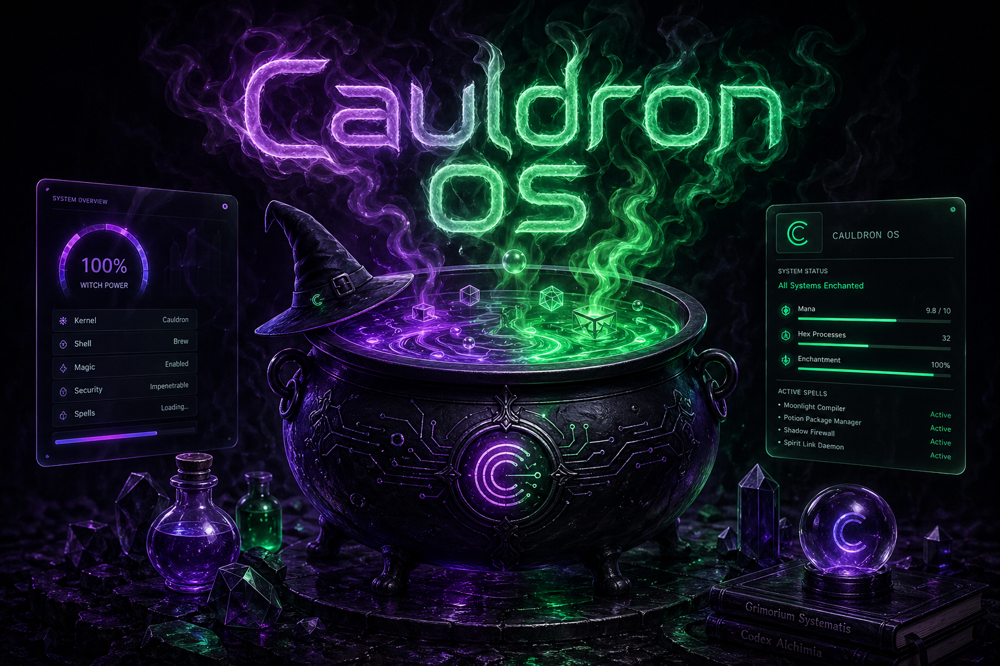
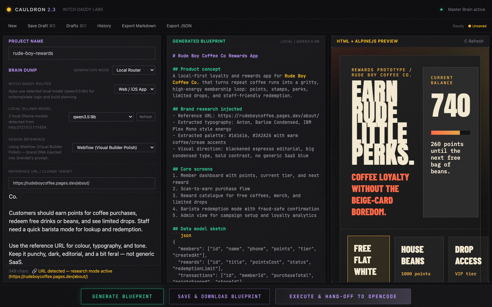
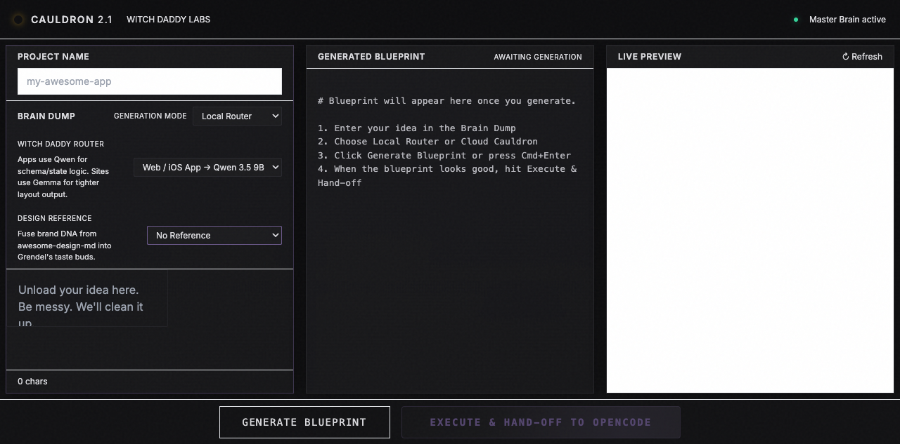

# Cauldron OS

[](LICENSE)
[](CHANGELOG.md)
[](https://nodejs.org)
[](https://github.com/witchdaddylabs)


> **Local-first, design-aware blueprint generator for builders who code with AI.**

[](LICENSE)
[](docs/)
[]()

---

## TL;DR

Cauldron OS turns vague LLM prompts into structured, implementable blueprints — with **premium design taste**, **brand DNA**, and **site research** built right in. Run it locally, keep your ideas private, and hand off clean specs to OpenCode/Cline/Claude Code.

```bash
git clone https://github.com/witchdaddylabs/cauldron-os
cd cauldron-os
npm install
node server.js
# → Open http://localhost:3000
```

---

## Why Cauldron?

Most LLM coding assistants give you *vague* output: "Build a nice dashboard with a clean UI." You get a wall of text with no structure, no design constraints, and no respect for brand consistency.

**Cauldron fixes that by injecting three layers of intelligence before the LLM even sees your prompt:**

1. **Impeccable Taste** — ANTI-PATTERNS + MANDATES stop generic Inter/Roboto, pure #000, nested cards, and blue gradients. Forces high-contrast typography, vertical rhythm, and micro-interactions.
2. **Design Reference Selector** — Pull brand DNA from the VoltAgent awesome-design-md collection (Cursor, Vercel, Lovable, Raycast) and prepend it to the prompt so the AI thinks in that brand's visual language.
3. **URL Research Sweep** — Paste any website URL in your brain dump, and Cauldron automatically scrapes its CSS variables, fonts, colors, and layout patterns — injecting those findings so the output feels familiar.

Result: You get a **PRD**, **database schema**, **security posture**, **architecture notes**, **live HTML preview**, **local draft history**, **Markdown/JSON exports**, and a **handoff-ready** project folder — all in a consistent, premium aesthetic.

---


<div align="center">



</div>


## Features

### For Solo Builders
- Generate complete app blueprints in one keystroke (Cmd+Enter)
- Save/load drafts locally with a searchable history log
- Export blueprints as Markdown or JSON without leaving the browser
- Local LLM via Ollama — no API costs, no data leaves your machine
- Optional cloud fallback (OpenAI GPT-5.4 / Google Gemini 2.5) with your own API key
- Automatic project scaffolding + OpenCode/CLI handoff

### For Design-Conscious Teams
- Design Reference dropdown applies brand DNA from popular design systems
- URL research mode lets you clone the feel of existing sites
- Consistent spacing, typography, component states across all outputs

### For Open Source Contributors
- Clean, well-commented codebase (~500 lines server, ~650 lines frontend)
- Skill-based architecture — each "Master Brain" upgrade is a reusable module
- Easy to extend with new design systems, research scrapers, or prompt injections

---

## Screenshots

> _Screenshots go here — dark UI with neon accents, three-panel layout (Brain Dump | Blueprint | Live Preview)_

---

## Quick Start

### Prerequisites
- Node.js 18+ (native fetch support)
- Ollama (for local models) **or** OpenAI/Google API keys (for cloud)
- Optional: OpenCode CLI for handoff (`npm i -g opencode`)

#
## Screenshots

**Full three-panel interface** — Brain Dump, Blueprint Output, Live Preview  


**Design Reference selector** — fuse brand DNA from Cursor, Vercel, Lovable, or Raycast  



## Quick Start (Non-Technical)

**Windows:** Double-click `start-cauldron.bat` in the repo folder  
**macOS / Linux:** Double-click `start-cauldron.ps1` (or run `node server.js`)

Both scripts will check for Node.js, install dependencies if needed, and start the server automatically.

---

## Installation

```bash
# Clone
git clone https://github.com/witchdaddylabs/cauldron-os.git
cd cauldron-os

# Install dependencies (Express + sql.js)
npm install

# Start the server
npm start
# or
node server.js
```

Open http://localhost:3000 — you're in.

### First Blueprint

1. Enter an idea: "A todo app with drag-and-drop reordering"
2. Select model: `gemma4:e4b` (fast) or `qwen3.5:9b` (detailed)
3. (Optional) Choose a Design Reference from the dropdown
4. (Optional) Paste a reference URL like `https://raycast.com` in your text
5. Press **Cmd+Enter** or click *Generate Blueprint*
6. Review the generated PRD, schema, architecture, and live HTML preview
7. Click *Execute & Hand-off* to spawn OpenCode and start building

---

## Project Structure

```
cauldron-os/
├── server.js              # Express backend (API + Ollama proxy + research scraper)
├── package.json           # Dependencies (express)
├── public/
│   └── index.html         # Frontend (vanilla JS, Tailwind CDN)
├── projects/              # Generated blueprints live here (gitignored)
├── docs/
│   ├── ARCHITECTURE.md    # How the Master Brain upgrades fit together
│   ├── DESIGN_REFERENCE.md # How to contribute new brand DNA
│   └── UPGRADES_2.1.md    # Full spec for the 2.1 upgrades
├── examples/
│   ├── sample-blueprint.md
│   └── DESIGN.md          # Example brand DNA file (Cursor)
├── scripts/
│   └── validate-json.js   # Blueprint schema linting (future)
├── design-systems/        # Brand DNA cache (populated on first run)
│   ├── cursor/
│   ├── vercel/
│   ├── lovable/
│   └── raycast/
├── LICENSE                # MIT License
└── README.md              # You are here
```

---

## Architecture

```
┌─────────────────────────────────────────────────────────────┐
│  Frontend (index.html) — Brain Dump | Blueprint | Preview  │
└───────────────┬─────────────────────────────────┬───────────┘
                │ POST /api/generate             │
                ▼                                 │
┌─────────────────────────────┐                   │
│  Server (server.js)          │                   │
│  ┌─────────────────────────┐ │                   │
│  │ Prompt Builder          │◄┘                   │
│  │ • DESIGN_GUIDE          │                      │
│  │ • Design Reference      │                      │
│  │ • URL Research Findings │                      │
│  └───────────┬─────────────┘                      │
│              │ POST to Ollama                      │
│              ▼                                     │
│    ┌─────────────────────┐                        │
│    │ Ollama (local)      │                        │
│    │ or Cloud (OpenAI/   │                        │
│    │ Gemini)             │                        │
│    └──────────┬──────────┘                        │
│               │                                    │
│               ▼                                    │
│  ┌─────────────────────┐                          │
│  │ Blueprint Response  │                          │
│  └──────────┬──────────┘                          │
│             │                                      │
│             ▼                                      │
│  ┌─────────────────────┐                          │
│  │ POST /api/handoff   │───► OpenCode (PID)      │
│  └─────────────────────┘       project/blueprint/ │
└─────────────────────────────────────────────────────┘
```

### The "Master Brain" Layer

The Master Brain upgrades (2.1) are three independent modules:

| Module | What it does | Files touched |
|--------|--------------|---------------|
| `impeccable-taste` | Injects DESIGN_GUIDE into system prompt | server.js (APP/SITE_SYSTEM_PROMPT) |
| `design-reference-selector` | Fetches + caches DESIGN.md, prepends to prompt | server.js (design cache, endpoints) + index.html (dropdown) |
| `url-research-sweep` | Scrapes URLs, extracts signals, formats for prompt | server.js (scrape/analyse) + index.html (detect/trigger) |

Each is a **skill** you can load independently in agent workflows. See `skills/` for docs.

---

## Configuration

### Environment Variables

None required. Secrets are stored in browser localStorage for cloud models.

### Port

Default: `3000`. Change by setting `PORT` env var.

### Ollama URL

Default: `http://127.0.0.1:11434/api/generate`. Change `OLLAMA_URL` in server.js if needed.

### Model Routing

| Project Type | Local Model | Fallback |
|--------------|-------------|----------|
| App (complex) | `qwen3.5:9b` | OpenAI GPT-5.4 |
| Site (static) | `gemma4:e4b` | Google Gemini 2.5 Flash |

You can override in the UI.

---

## Contributing

We welcome PRs! Please read [CONTRIBUTING.md](docs/CONTRIBUTING.md) first.

Areas where you can help:
- Add new design systems to `design-systems/` (Cursor, Linear, Arc browser, etc.)
- Improve URL research scraper (handle SPAs, more CSS properties)
- Add Docker support + docker-compose with Ollama
- Write additional prompt templates (mobile app, CLI tool, game)
- Accessibility audit of generated blueprints
- Testing suite (Jest + Supertest)

---

## License

**MIT License** — see [LICENSE](LICENSE) file.

You are free to:
- Use commercially
- Modify
- Distribute
- Sublicense

Under the condition: keep the license notice in all copies.

**Attribution:** While not required by the MIT license, we appreciate a link back to https://github.com/witch-daddy-labs/cauldron-os if you found this tool helpful.

---

## Acknowledgments & Inspirations

This project stands on the shoulders of giants:

- **[impeccable.style](https://impeccable.style)** — the original design taste manifesto that sparked the idea
- **[taste-skill](https://github.com/Leonxlnx/taste-skill)** by Leonxlnx — high-agency frontend tasteBud for AI; inspired the ANTI-PATTERNS/MANDATES format
- **[ai-website-cloner-template](https://github.com/JCodesMore/ai-website-cloner-template)** by JCodesMore — reconnaissance approach adapted for URL Research Sweep
- **[VoltAgent/awesome-design-md](https://github.com/VoltAgent/awesome-design-md)** — DESIGN.md specification and brand DNA collection

Additionally: Witch Daddy Labs minions (Marion, et al.) for iterative testing and quality feedback.

---

## Community

- **Discord** (coming soon): Witch Daddy Labs community
- **Issues**: https://github.com/witch-daddy-labs/cauldron-os/issues
- **Showcase**: Tag @witchdaddylabs on Twitter/X if you build something with Cauldron

---

> *"Good design is obvious. Great design is transparent."*  
> — Ancient code cave proverb, probably

---

**Happy cooking. 🔥**


---

<div align="center">

**Built with 💜 by [Witch Daddy Labs](https://witchdaddylabs.com)**

[](LICENSE)

</div>
