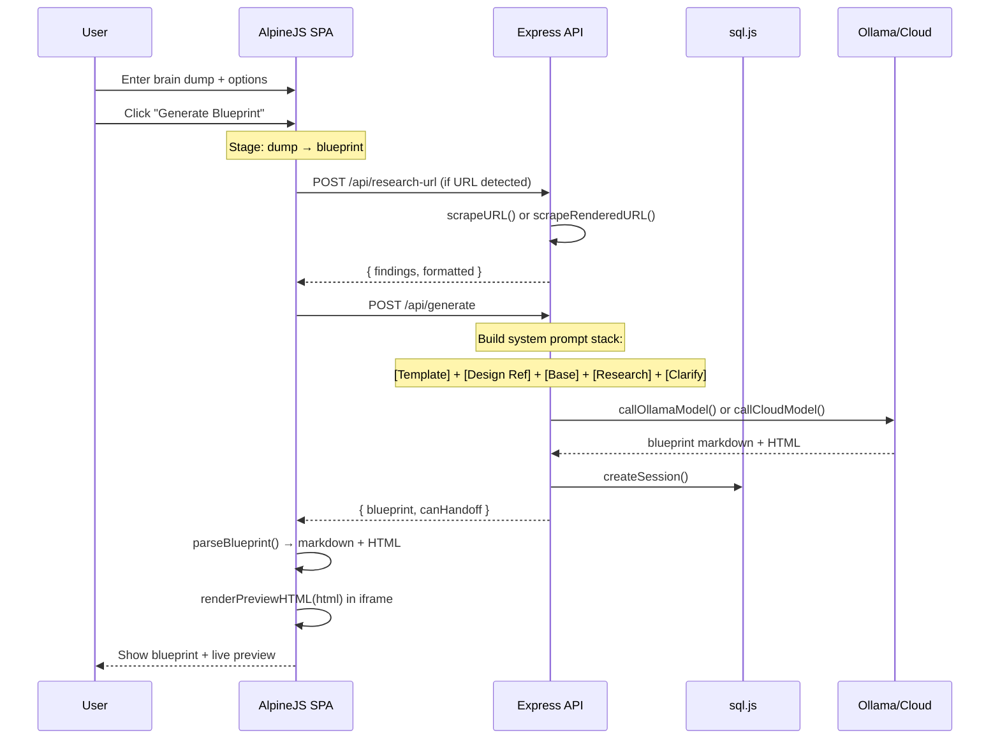
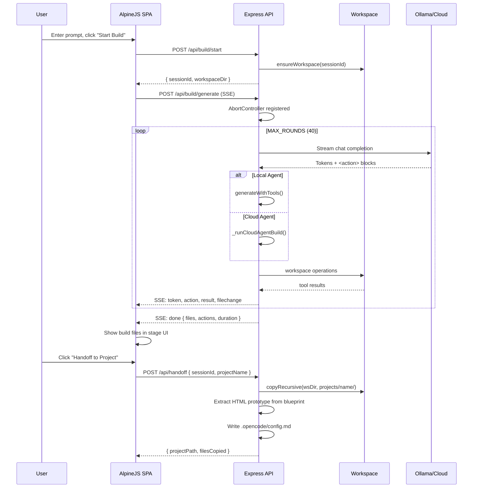
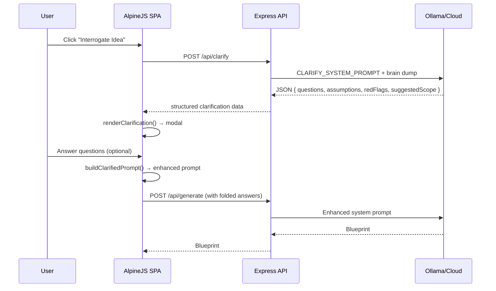

# Cauldron OS Architecture

**Version:** v0.30  
**Core Principle:** Local-first, design-aware, multi-agent build pipeline.  
**Tagline:** Sewer-to-ship. Brain dump to handoff. One OS.

---

## System Overview

Cauldron OS is a Node.js/Express server that runs a complete project-building pipeline — from raw idea to deployable code. It combines a structured 7-stage AlpineJS SPA frontend with an Express API backend, an XML-tool-calling agent system, a design intelligence layer (Master Brain), and an OpenCode-based handoff flow.

```
User Idea → 7-Stage SPA → API Backend → Master Brain Prompt Enrichment
  → LLM (Ollama / Cloud) → Blueprint / Prototype / Build → Handoff
```

Two LLM interaction modes exist side-by-side:
- **Blueprint Mode** — single-turn generation (prompt → blueprint markdown + HTML prototype)
- **Agent Build Mode** — multi-turn XML tool loop (prompt → model writes/edits/runs files via `<action>` blocks)

---

## 1. Frontend Architecture (`public/`)

### 1.1 7-Stage SPA (AlpineJS)

The frontend is a single-page application built with AlpineJS. No bundler. Files served statically by Express.

**Files:**
- `public/index.html` — app shell, stage navigation, settings modals
- `public/scripts/app.js` — Alpine component (`cauldronApp()`), all app logic
- `public/styles/tokens.css` — design tokens (colors, spacing, fonts, radii)
- `public/styles/app.css` — component styles, layout, animations

**7-Stage Pipeline:**

```
dump → interrogate → system → blueprint → prototype → build → export
```

| Stage | ID | Purpose |
|-------|----|---------|
| Brain Dump | `dump` | Raw idea entry + reference URL input |
| Interrogate | `interrogate` | Annoying PM Mode — clarifies idea before generation |
| Design System | `system` | Select design reference / research DNA |
| Blueprint | `blueprint` | Generated spec with PRD, schema, architecture |
| Prototype | `prototype` | Live HTML+AlpineJS preview in iframe |
| Build | `build` | Agent-driven build with SSE streaming to workspace |
| Export | `export` | Save draft, handoff to OpenCode, download files |

**Stage state tracking:**
```javascript
get completedStages() {
  const complete = new Set()
  if (form.brainDump.trim())                    complete.add('dump')
  if (clarifyResult)                             complete.add('interrogate')
  if (form.designReference || researchResult)    complete.add('system')
  if (blueprint)                                 complete.add('blueprint')
  if (prototypeHtml)                             complete.add('prototype')
  if (buildSession)                              complete.add('build')
  if (savedDraftId || handoffResult)             complete.add('export')
  return complete
}
```

**Per-stage model routing:**
Each stage can use a different provider/model. Stored in localStorage as `stageModels`:
```javascript
stageModels: {
  interrogate: { provider: 'gemini',  cloudModel: '' },
  blueprint:   { provider: 'openai',  cloudModel: '' },
}
```

**Key frontend functions:**
- `detectURLs(text)` — regex finds `https?://...` in brain dump
- `triggerResearch(mode)` — POST /api/research-url with `fast` or `deep` mode
- `interrogateIdea()` — POST /api/clarify → opens Annoying PM modal
- `generateBlueprint()` — builds clarified prompt → POST /api/generate → renders markdown + iframe
- `refineBlueprint()` — POST /api/refine with refinement text
- `startAgentBuild()` — POST /api/build/start → /api/build/generate with SSE
- `parseBlueprint(text)` — extracts ` ```html ``` ` block from markdown
- `renderPreviewHTML(html)` — writes into preview iframe with AlpineJS CDN injection
- `handoff()` — POST /api/handoff → creates `projects/{name}/`

---

## 2. Backend Architecture (`server.js`)

Express server on port 3000 (default). Single monolithic file (~2,200 LOC) due to the unified sprint.

**Imports:**
```
express, path, fs, child_process, https, http, crypto, playwright
db, xml-parser, workspace, tools, agent-loop
```

### 2.1 API Routes

#### Core Pipeline Routes

| Route | Method | Purpose |
|-------|--------|---------|
| `/api/generate` | POST | Single-turn blueprint generation (Ollama or Cloud) |
| `/api/refine` | POST | Refine existing blueprint |
| `/api/clarify` | POST | Annoying PM Mode — generates clarifying questions |
| `/api/research-url` | POST | URL research (fast=regex, deep=Playwright) |
| `/api/handoff` | POST | Save blueprint + prototype + OpenCode stub to `projects/` |
| `/api/health` | GET | `{ status: 'ok', service: 'Cauldron OS v0.30' }` |

#### Build API (XML Agent System)

| Route | Method | Purpose |
|-------|--------|---------|
| `/api/build/start` | POST | Create build session + workspace directory |
| `/api/build/generate` | POST | SSE — multi-turn agent build (local or cloud) |
| `/api/build/refine` | POST | SSE — continue/refine an existing build session |
| `/api/build/stop` | POST | Abort an active build (aborts AbortController) |
| `/api/build/files/:sessionId` | GET | List files in build workspace |
| `/api/build/file/:sessionId` | GET | Read file content from build workspace |
| `/api/build/status/:sessionId` | GET | Build session metadata + file summary |

#### Data Routes

| Route | Method | Purpose |
|-------|--------|---------|
| `/api/drafts` | GET/POST | List / create saved drafts |
| `/api/drafts/:id` | GET | Load draft by ID |
| `/api/drafts/:id/export.md` | GET | Download draft as markdown |
| `/api/drafts/:id` | DELETE | Delete draft |
| `/api/history` | GET | Session history |
| `/api/history/cleanup` | POST | Purge old sessions |
| `/api/stats` | GET | Dashboard statistics |

#### Research Routes

| Route | Method | Purpose |
|-------|--------|---------|
| `/api/research-history` | GET | List research records (searchable, filterable by favorite) |
| `/api/research-history/:id/favorite` | POST | Toggle favorite on research record |

#### Project / Status Routes

| Route | Method | Purpose |
|-------|--------|---------|
| `/api/templates` | GET | Available scaffold templates |
| `/api/build-status` | GET | Full project status dashboard |
| `/api/projects/:name/status` | POST/DELETE | Set / clear manual status overrides |
| `/api/projects/:name/resume` | POST | Resume stalled build via OpenCode |
| `/api/projects/:name/open-visible` | POST | Open project in visible Terminal window |
| `/api/projects/import` | POST | Import existing project folders as drafts |

#### Model Routes

| Route | Method | Purpose |
|-------|--------|---------|
| `/api/cloud-models` | GET | Available cloud providers and models |
| `/api/ollama-models` | GET | Auto-detected local Ollama models |
| `/api/design-systems` | GET | Available brand design references |
| `/api/design-reference` | POST | Pre-fetch design system content into cache |
| `/api/chat/completions` | POST | OpenAI-compatible chat proxy |

#### Static Middleware

| Route | Purpose |
|-------|---------|
| `/workspace-preview/:sessionId/*` | Serve build workspace files for live preview |
| `/research-assets/*` | Serve research screenshots |

### 2.2 Prompt Building (Master Brain)

The system prompt is assembled as a stack:

```
[Template Guidance (optional)]
+ [Design Reference (optional)]
+ [Base Prompt: APP_SYSTEM_PROMPT or SITE_SYSTEM_PROMPT]
+ [Research Findings (optional)]
+ [Clarification Answers (optional)]
```

**Base prompts** (`APP_SYSTEM_PROMPT` / `SITE_SYSTEM_PROMPT`) bake in the `DESIGN_GUIDE` which enforces:
- Anti-patterns (no Inter/Roboto default, no pure black, no nested cards, no placeholder code)
- Mandates (high-contrast typography, generous spacing, component states, premium aesthetic)

```javascript
function getSystemPrompt(projectType, designReference) {
  let base = projectType === 'site' ? SITE_SYSTEM_PROMPT : APP_SYSTEM_PROMPT
  if (designReference && designReference !== 'none') {
    const designContent = designSystemCache.get(designReference)
    if (designContent) {
      base = `# Design Reference: ${name}\n\n${designContent}\n\n---\n\n${base}`
    }
  }
  return base
}
```

### 2.3 Cloud Model Routing

`callCloudModel()` provides a provider abstraction layer:

```javascript
async function callCloudModel({ provider, apiKey, prompt, systemPrompt, projectType, requestedModel, baseUrl })
```

- **Supported providers:** `openai`, `gemini`
- **Base URL normalization:** `normaliseOpenAICompatibleChatUrl()` handles flexible endpoints
- **Model inference:** `inferProviderFromModel()` maps model name prefixes → providers (gemini-, gpt-, claude-, bedrock-, nvidia/, deepseek, qwen, etc.)
- **Timeout:** `CLOUD_TIMEOUT_MS = 300000` (5 min)
- **Auth:** Bearer token from API key

OpenAI-compatible proxy at `/api/chat/completions` forwards to any OpenAI-compatible endpoint, supporting streaming (SSE) passthrough.

### 2.4 Local Model Routing

`callOllamaModel()` sends requests to Ollama's `/api/generate` endpoint:

```javascript
{
  model, prompt, system: systemPrompt,
  stream: false,
  options: { num_predict, temperature, top_p: 0.9 }
}
```

- **Timeout:** `OLLAMA_TIMEOUT_MS = 600000` (10 min)
- **Num predict:** `BLUEPRINT_NUM_PREDICT = 8192`, `CLARIFY_NUM_PREDICT = 2048`
- **Temperature:** 0.55 for blueprints, 0.35 for clarify

Auto-detection via `/api/ollama-models` hits Ollama's `/api/tags` (5s timeout).

---

## 3. XML Tool Agent System (`lib/`)

The agent system enables multi-turn LLM-driven project building via XML action blocks.

### 3.1 Architecture

```
LLM Output → xml-parser.js (parse <action> blocks) → tools.js (execute) → workspace.js (sandbox)
```

### 3.2 `agent-loop.js` — Multi-Turn Controller

```javascript
const MAX_ROUNDS = 40

async function* generateWithTools({ prompt, model, systemPrompt, sessionId, ... }) {
  // 1. Build system prompt with tool descriptions + workspace state
  // 2. Send user prompt to model (Ollama API)
  // 3. Stream tokens, detect <action> blocks
  // 4. Execute tools, feed results back as user messages
  // 5. Loop until no more actions or MAX_ROUNDS
}
```

- Uses an `async generator` for streaming yields
- Yields `{ token }` chunks and `{ done, files, actions }` final result
- Supports `onStream`, `onAction`, `onFileChange` callbacks
- Cloud variant: `_runCloudAgentBuild()` — same loop via OpenAI-compatible streaming

### 3.3 `tools.js` — Tool Definitions

Seven tools registered in `toolDefinitions` array:

| Tool | Description | Params |
|------|-------------|--------|
| `write_file` | Write file with auto-create dirs | `path`, `content` |
| `read_file` | Read file content | `path` |
| `edit_file` | Find-and-replace editing | `path`, `old_string`, `new_string`, `replace_all` |
| `delete_file` | Delete file | `path` |
| `list_files` | Recursive workspace listing | _(none)_ |
| `run_bash` | Execute shell commands | `command`, `timeout` |
| `read_result` | Read result file | `path` |

Each tool has `{ name, description, params[], run(ctx, args) }` structure.

`toolsSystemPrompt()` generates XML schema documentation for the model:
```xml
<action name="write_file">
  <path>src/index.html</path>
  <content><![CDATA[...]]></content>
</action>
```

### 3.4 `xml-parser.js` — Action Parser

Parses raw LLM output for `<action name="...">` blocks:

```javascript
findNextAction(text, fromIndex)
// Returns: { name, args: { path, content, command, ... }, raw, start, end }
//       or: 'incomplete' (block started, no </action> yet)
//       or: null (no action found)
```

- Case-insensitive tag matching
- `_parseParams(innerText)` handles raw string params (`<content>`, `<command>`) via `lastIndexOf` to survive nested HTML
- Other params extracted via regex

### 3.5 `workspace.js` — Sandboxed File System

All file operations sandboxed to `data/workspaces/<sessionId>/`:

```javascript
const BASE_WORKSPACE = path.resolve(__dirname, '..', 'data', 'workspaces')
```

**Path traversal protection:**
```javascript
if (filePath.includes('..')) {
  throw new Error(`Security: Path traversal detected in "${filePath}"`)
}
```

**Public API:**
- `ensureWorkspace(sessionId)` — create sandbox dir
- `workspaceDir(sessionId)` — absolute path
- `wsWriteFile(sessionId, path, content)` — write with auto-create dirs
- `wsReadFile(sessionId, path)` — read
- `wsEditFile(sessionId, path, oldStr, newStr, replaceAll)` — patch with fuzzy matching
- `wsDeleteFile(sessionId, path)` — delete
- `wsListFiles(sessionId)` — recursive file listing
- `wsRunBash(sessionId, command)` — execute shell command (60s timeout, 10MB buffer)
- `cleanupWorkspace(sessionId)` — remove workspace dir

---

## 4. Build Pipeline

### 4.1 Flow

```
1. User clicks "Start Build" in Stage 6
2. POST /api/build/start → creates session + workspace
3. POST /api/build/generate (SSE) → streaming agent build
   - Local: generateWithTools() via Ollama
   - Cloud: _runCloudAgentBuild() via OpenAI/Gemini streaming
4. SSE events: token, action, result, filechange, done, error
5. User can refine via POST /api/build/refine (SSE)
6. POST /api/build/stop → aborts via AbortController
7. User reviews files via GET /api/build/files/:sessionId
8. POST /api/handoff → copies workspace to projects/{name}/
```

### 4.2 Build Session State

```javascript
const activeBuildControllers = new Map()  // sessionId → AbortController
const buildSessions = new Map()            // sessionId → metadata
```

Session metadata:
```javascript
{
  sessionId, prompt, model, designReference,
  templateId, projectType, workspaceDir,
  startedAt, completedAt, duration,
  actions: [], files: [], status
}
```

### 4.3 SSE Event Types

| Event | Payload | When |
|-------|---------|------|
| `token` | `{ text }` | Streamed model token |
| `action` | `{ tool, path, status }` | Tool execution started |
| `result` | `{ tool, path, status, output }` | Tool execution completed |
| `filechange` | `{ path }` | File created/modified |
| `done` | `{ files, actions, duration, draftId }` | Build completed |
| `error` | `{ message }` | Build failed |

### 4.4 Workspace Preview

`/workspace-preview/:sessionId/*` serves files from `data/workspaces/<sessionId>/`:
- `GET /workspace-preview/:sessionId/` → serves `index.html` if present
- `GET /workspace-preview/:sessionId/src/app.js` → serves nested files
- CORS headers set for iframe embedding
- Path traversal blocked

---

## 5. Database Schema (`db/index.js`)

**Engine:** sql.js (SQLite compiled to WebAssembly)  
**File:** `data/cauldron.db`  
**Data dirs:** `data/drafts/`, `data/drafts/.meta/`

### Tables

```sql
CREATE TABLE drafts (
  id INTEGER PRIMARY KEY AUTOINCREMENT,
  project_name TEXT NOT NULL,
  brain_dump TEXT DEFAULT '',
  blueprint TEXT NOT NULL,
  design_reference TEXT DEFAULT 'none',
  generation_mode TEXT DEFAULT 'local',
  model_used TEXT,
  file_path TEXT UNIQUE,
  created_at TEXT DEFAULT CURRENT_TIMESTAMP,
  updated_at TEXT DEFAULT CURRENT_TIMESTAMP
)

CREATE TABLE sessions (
  id INTEGER PRIMARY KEY AUTOINCREMENT,
  session_id TEXT UNIQUE,
  brain_dump TEXT DEFAULT '',
  url_research TEXT,
  design_reference TEXT DEFAULT 'none',
  generation_mode TEXT DEFAULT 'local',
  model_used TEXT,
  draft_id INTEGER,
  created_at TEXT DEFAULT CURRENT_TIMESTAMP,
  FOREIGN KEY (draft_id) REFERENCES drafts(id)
)

CREATE TABLE research_history (
  id INTEGER PRIMARY KEY AUTOINCREMENT,
  url TEXT NOT NULL UNIQUE,
  source TEXT DEFAULT 'url-sweep',
  project_name TEXT DEFAULT '',
  brain_dump TEXT DEFAULT '',
  findings_json TEXT NOT NULL,
  formatted TEXT DEFAULT '',
  favorite INTEGER DEFAULT 0,
  reuse_count INTEGER DEFAULT 1,
  created_at TEXT DEFAULT CURRENT_TIMESTAMP,
  updated_at TEXT DEFAULT CURRENT_TIMESTAMP,
  last_used_at TEXT DEFAULT CURRENT_TIMESTAMP,
  draft_id INTEGER,
  FOREIGN KEY (draft_id) REFERENCES drafts(id)
)

CREATE TABLE project_status_overrides (
  project_name TEXT PRIMARY KEY,
  status TEXT NOT NULL,
  note TEXT DEFAULT '',
  updated_at TEXT DEFAULT CURRENT_TIMESTAMP
)
```

### Key Functions

- `createDraft()` — saves blueprint to SQLite + filesystem copy in `data/drafts/`
- `createSession()` — logs generation sessions linked to drafts
- `upsertResearchRecord()` — dedup by URL, increments `reuse_count`
- `setProjectStatusOverride()` — manual status override for build monitoring
- `getBuildStatus()` — auto-classifies project status (running/stalled/completed/needs_review/unknown) by analyzing log tails, process tables, and file presence

---

## 6. Master Brain Layers

### 6.1 Impeccable Taste (Grendel)

- `DESIGN_GUIDE` constant with ANTI-PATTERNS + MANDATES
- Baked directly into `APP_SYSTEM_PROMPT` and `SITE_SYSTEM_PROMPT`
- No separate file — inline in `server.js`

### 6.2 Design Reference Selector

- 150 local `DESIGN.md` systems imported from Open Design and indexed by `design-systems/catalog.json`
- Refero styles from `refero.design`
- Local files, Refero prompt guidance, and legacy remote fallbacks share `designSystemCache` (Map)
- Local source: `design-systems/{handle}/DESIGN.md`

### 6.3 URL Research Sweep

Two modes:
- **Fast mode** (default): `http.get` → regex analysis of raw HTML
  - Extracts: Google Fonts families, CSS custom properties, hex/rgb/hsl colors, structure notes (flex/grid/containers)
- **Deep mode** (`mode=deep`): Playwright headless Chromium
  - Full page render at 1440×1200 viewport
  - Screenshot saved to `data/research/screenshots/`
  - Computed style extraction: fontFamily, color, backgroundColor, borderColor, borderRadius, boxShadow, fontSize, cssVars
  - DOM structure analysis (tag#id.class)
  - `networkidle` wait with 8s timeout

### 6.4 Annoying PM Mode (Interrogate)

- `CLARIFY_SYSTEM_PROMPT` instructs model to return strict JSON
- Schema: `{ questions[], assumptions[], redFlags[], suggestedScope[] }`
- Questions are 5–8 focused product-manager queries
- Answers folded into blueprint prompt via `buildClarifiedPrompt()`

---

## 7. Design Systems

**150+ selectable entries** in `DESIGN_SYSTEMS`:

### Imported Open Design Catalog
150 local `DESIGN.md` systems live under `design-systems/{handle}/DESIGN.md` and are indexed by `design-systems/catalog.json`.

### Refero Styles (refero.design)
Refero styles are represented as prompt-guidance entries and can also be searched live through `/api/refero-search`.

Refero search proxies `https://styles.refero.design/api/styles`; curated Refero prompt entries also keep UUID metadata for future style-detail use.

---

## 8. Scaffold Templates

Four template types guide generation output:

| ID | Name | Project Type | Files |
|----|------|-------------|-------|
| `static-html` | Static HTML/CSS | site | index.html, styles.css, README.md, blueprint.md, cauldron.project.json |
| `html-alpine` | HTML + AlpineJS | prototype | index.html, styles.css, README.md, blueprint.md, cauldron.project.json |
| `react-vite-tailwind` | React + Vite + Tailwind | app | package.json, index.html, src/App.jsx, src/main.jsx, src/styles.css, ... |
| `next-app-router` | Next.js App Router | app | package.json, app/page.tsx, app/layout.tsx, app/globals.css, ... |

Template guidance is injected into the system prompt via `formatTemplateForPrompt()`.

---

## 9. Handoff Flow

`POST /api/handoff` creates:

```
projects/{projectName}/
├── blueprint.md          — full product specification
├── prototype.html        — extracted HTML + AlpineJS prototype (with CDN injection)
├── .opencode/
│   └── config.md         — OpenCode task stub
└── (workspace files)     — copied from build session if sessionId provided
```

- Prototype HTML is extracted from ` ```html ``` ` blocks in the blueprint
- AlpineJS CDN is auto-injected if Alpine directives are detected
- If `sessionId` is provided, workspace files are copied into the project directory
- Build status is set to `needs_review` by default

---

## 10. Cloud Model Proxy

`POST /api/chat/completions` acts as a transparent proxy:

- Accepts OpenAI-compatible request format
- Routes based on `inferProviderFromModel()` (gemini-, gpt-, claude-, etc.)
- Supports streaming passthrough
- Falls back to Gemini or OpenAI based on model prefix
- Custom `base_url` for self-hosted OpenAI-compatible endpoints

---

## 11. Build Status Monitoring

`GET /api/build-status` auto-classifies every project in `projects/`:

| Status | Criteria |
|--------|----------|
| `running` | Active process detected (opencode, npm run dev, next dev, vite, astro) |
| `stalled` | Log tail contains error keywords |
| `completed` | Log tail contains build completion keywords |
| `needs_review` | Package.json present, no errors, needs manual check |
| `unknown` | Has log but no clear signal |
| (override) | Manual via `POST /api/projects/:name/status` |

Uses `ps -axo pid,ppid,stat,etime,command` for process detection on macOS/Linux.

`project_status_overrides` table allows manual status correction:
```javascript
{ project_name, status, note, updated_at }
```

---

## 12. Data Flow Diagrams

### 12.1 Blueprint Generation



### 12.2 Agent Build Pipeline



### 12.3 Annoying PM Mode



### 12.4 Database Schema

```mermaid
erDiagram
    DRAFTS ||--o{ SESSIONS : "draft_id"
    DRAFTS ||--o{ RESEARCH_HISTORY : "draft_id"
    DRAFTS {
        int id PK
        string project_name
        text brain_dump
        text blueprint
        string design_reference
        string generation_mode
        string model_used
        string file_path UNIQUE
        datetime created_at
        datetime updated_at
    }
    SESSIONS {
        int id PK
        string session_id UNIQUE
        text brain_dump
        text url_research
        string design_reference
        string generation_mode
        string model_used
        int draft_id FK
        datetime created_at
    }
    RESEARCH_HISTORY {
        int id PK
        string url UNIQUE
        string source
        string project_name
        text brain_dump
        text findings_json
        text formatted
        int favorite
        int reuse_count
        datetime created_at
        datetime updated_at
        datetime last_used_at
        int draft_id FK
    }
    PROJECT_STATUS_OVERRIDES {
        string project_name PK
        string status
        string note
        datetime updated_at
    }
```

---

## 13. Extension Points

### Adding a New Design System
1. Create `design-systems/{handle}/DESIGN.md`
2. Add the entry to `design-systems/catalog.json`
3. Run `node scripts/validate-design-systems.js`
4. Refero styles still live as prompt-guidance entries in `server.js`

### Adding a New Template
1. Add entry to `TEMPLATES` array in `server.js`
2. Define `{ id, name, projectType, scaffold, files, promptBias }`
3. Template guidance auto-injects into system prompt on `/api/generate`

### Adding a New Tool
1. Add definition to `toolDefinitions[]` in `lib/tools.js`
2. Define `{ name, description, params[], run(ctx, args) }`
3. `toolsSystemPrompt()` auto-generates the XML documentation

### Adding a New Cloud Provider
1. Add entry to `CLOUD_MODELS` in `server.js`
2. Add provider URL constant
3. Update `inferProviderFromModel()` for model prefix matching
4. Update `callCloudModel()` if auth differs from Bearer token

### Adding a New Database Table
1. Add `CREATE TABLE IF NOT EXISTS` in `db/index.js` `runMigrations()`
2. Add CRUD functions + export them from `module.exports`

---

## 14. Security Considerations

- **No authentication** — Cauldron is localhost-only. Exposing externally requires adding auth.
- **API keys** — stored in browser localStorage. Sent to OpenAI/Gemini only from backend.
- **Workspace sandbox** — `data/workspaces/<sessionId>/` with explicit path traversal blocking (`..` detection in `_resolvePath()`)
- **Workspace preview** — path check `fullPath.startsWith(wsDir)` prevents directory escape
- **URL research** — SSRF risk for internal IPs. Currently assumes single-user local context.
- **OpenCode handoff** — runs with full filesystem access to `projects/{name}/`
- **Build session IDs** — client-controlled. Sanitized to `a-zA-Z0-9_-` in file routes
- **Project names** — sanitized via `safeProjectName()` (alphanumeric + hyphen/underscore only)
- **Process detection** — `ps -axo` runs with 2s timeout, no injection vector

---

## 15. Performance Notes

- **Design reference cache** — in-memory Map. Cold fetch per brand takes 200-500ms.
- **Fast research** — regex-based, sub-second for most pages.
- **Deep research** — Playwright headless browser launch + full page render (~3-8s).
- **Single-turn generation** — non-streaming. Large blueprints at 8192 tokens take 60-90s on local 9B models.
- **Agent builds** — up to 40 rounds. Cloud streaming is faster per-round. Local builds depend on model speed.
- **Small local models** (9b–E4B) — viable for blueprints, weak for interrogate.
- **Recommended local minimum for clarify:** 27b+ (Gemma 4:26b, Qwen 3.5/3.6:27b).
- **Frontend** — no bundler. CSS custom properties for theming. AlpineJS adds ~30KB gzipped.

---

## 16. Project Structure

```
cauldron-os/
├── server.js                    # Express API server (~2,200 LOC)
├── package.json                 # v0.30
├── lib/
│   ├── agent-loop.js            # Multi-turn agent controller (MAX_ROUNDS=40)
│   ├── tools.js                 # 7 tool definitions + execution engine
│   ├── xml-parser.js            # <action> block parser
│   └── workspace.js             # Sandboxed file system (data/workspaces/<sessionId>/)
├── db/
│   └── index.js                 # sql.js database (4 tables)
├── public/
│   ├── index.html               # AlpineJS SPA shell
│   ├── scripts/
│   │   └── app.js               # cauldronApp() Alpine component
│   └── styles/
│       ├── tokens.css           # Design tokens
│       └── app.css              # Component styles
├── design-systems/              # Local design system fallbacks
│   ├── cursor/DESIGN.md
│   ├── lovable/DESIGN.md
│   ├── raycast/DESIGN.md
│   └── vercel/DESIGN.md
├── data/                        # Runtime data (gitignored)
│   ├── cauldron.db              # SQLite database
│   ├── drafts/                  # Blueprint markdown files
│   ├── workspaces/              # Build session sandboxes
│   └── research/                # Deep research screenshots
├── projects/                    # Handoff targets (gitignored)
├── tests/                       # Smoke test suite
├── docs/
│   ├── ARCHITECTURE.md          # This file
│   ├── DESIGN_REFERENCE.md
│   └── CONTRIBUTING.md
└── scripts/
    ├── pre-publish.js
    └── validate-blueprint.js
```

---

## 17. Environment Variables

| Variable | Default | Purpose |
|----------|---------|---------|
| `PORT` | `3000` | Server listen port |
| `OLLAMA_BASE_URL` | `http://127.0.0.1:11434` | Ollama API base URL |
| `CAULDRON_DATA_DIR` | `./data` | Runtime data directory |
| `CAULDRON_CLARIFY_NUM_PREDICT` | `2048` | Max tokens for clarify output |
| `CAULDRON_BLUEPRINT_NUM_PREDICT` | `8192` | Max tokens for blueprint output |

---

## 18. Dependencies

**Runtime:**
- `express` ^5.2.1 — HTTP server
- `sql.js` ^1.14.1 — SQLite via WebAssembly
- `playwright` ^1.59.1 — Deep research (headless Chromium)

**Dev:** `node --watch` (built into Node.js 22+)

---

*Architecture document version: v0.30 — Written by Hermes Agent for Witch Daddy Labs*
